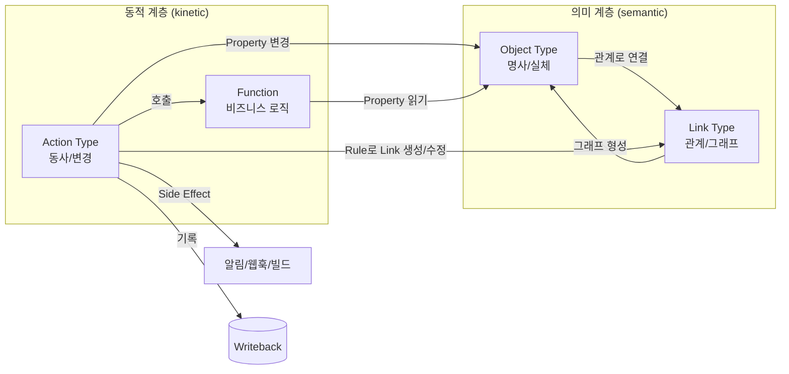
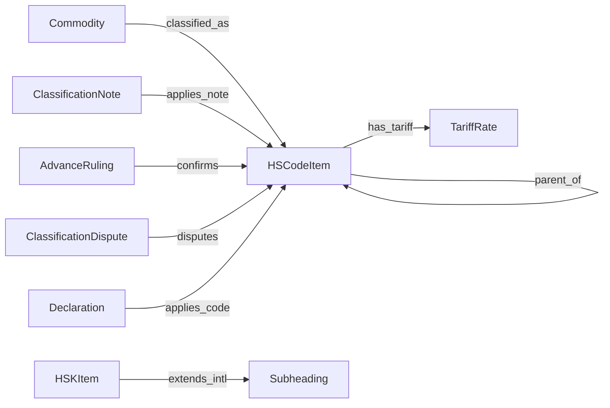
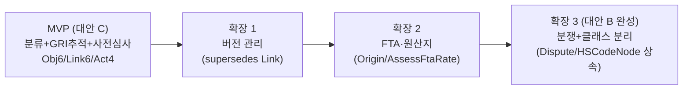

# HS코드 온톨로지 적용 방안 — 팔란티어 3-layer 패턴 기반

**작성일**: 2026-05-27
**버전**: 1.0
**작성**: report-writer 에이전트 (입력: 팔란티어 리서치 · HS코드 도메인 분석 · 온톨로지 설계안 통합)

---

## 1. Executive Summary

본 보고서는 팔란티어(Palantir) 3-layer 온톨로지 패턴인 **Object(객체) / Link(관계) / Action(행위)** 을 한국의 **HS코드(통일상품명 및 부호체계, Harmonized System)** 도메인에 적용하기 위한 설계 대안을 비교하고 권고안을 제시합니다.

**핵심 결론**: 세 가지 설계 대안 — 대안 A(보수적 최소 코어), 대안 B(확장적 전체 거버넌스), 대안 C(하이브리드, 단계적 확장형) — 중 **대안 C(하이브리드)를 최초 도입(MVP)안으로 채택하고, 단계적으로 대안 B 수준까지 확장할 것을 권고**합니다.

권고 근거는 다음과 같습니다.

- **대안 A**는 빠르게 구축할 수 있으나, HS 도메인의 차별적 가치인 **분류 근거 추적(GRI, 통칙 General Rules for the Interpretation)** 과 **사전심사(Advance Ruling)의 법적 효력**을 표현하지 못해 단순 코드 조회기에 머뭅니다.
- **대안 B**는 사전심사·분쟁·FTA(자유무역협정)까지 포괄하는 완성도 높은 운영 온톨로지이나, 객체 13종·링크 12종·액션 6종으로 초기 구축 및 데이터 적재 부담이 큽니다.
- **대안 C**는 운영을 단순하게 유지(단일 분류항목 클래스)하면서도, B의 핵심 거버넌스 자산인 **GRIRule 객체 + governed_by 링크**(분류 근거 추적)와 **AdvanceRuling + confirms**(사전심사 법적 효력)만 선별 도입하여, 투자 대비 효과(ROI)가 가장 높다고 판단됩니다.

또한 모든 대안에 공통으로 누락된 결함으로, HS가 5~6년 주기로 개정될 때 구(舊)코드와 신(新)코드를 연결하는 **`supersedes` 링크 유형(Link Type)** 을 즉시 보강할 것을 권고합니다.

도입 로드맵은 **MVP(대안 C) → 확장 1(버전 관리) → 확장 2(FTA·원산지) → 확장 3(분쟁·클래스 분리, 대안 B 완성)** 의 4단계로 제안합니다.

---

## 2. 배경 및 목적

### 2.1 왜 온톨로지인가

팔란티어 온톨로지(Palantir Ontology)는 조직의 디지털 자산(데이터셋·테이블·모델)과 현실 세계의 실체(상품·거래·신고 등)를 연결하는 **운영 계층(operational layer)** 입니다. 공식 문서는 온톨로지를 **의미(semantic) 요소** 와 **동적(kinetic) 요소** 로 구분합니다.

- **의미 요소**: 무엇이 존재하고 어떻게 연결되는가 — Object / Property / Link
- **동적 요소**: 그것을 거버넌스 통제 하에서 어떻게 변화시키는가 — Action / Function

본 보고서가 다루는 **3-layer(Object / Link / Action)** 는 이 의미·동적 요소를 세 가지 핵심 구현 축으로 재구성한 개념적 분류입니다. 단순한 데이터베이스 스키마를 넘어, "현실의 디지털 트윈"을 구성하고 거버넌스 하에서 이를 변화시키는 운영 모델을 제공한다는 점에서, 복잡한 규칙·관계·절차가 얽힌 도메인에 적합합니다.

### 2.2 왜 HS코드인가

HS코드는 세계관세기구(WCO, World Customs Organization)가 제정·관리하는 국제 표준 상품분류 체계로, 전 세계 200여 개국·경제권에서 관세 부과·무역통계·원산지/FTA 판정·규제/검역의 기준으로 사용됩니다. HS코드 도메인은 다음과 같은 특성 때문에 온톨로지 적용의 적합한 대상입니다.

- **엄격한 계층(트리) 구조**: 부(Section) → 류(Chapter) → 호(Heading) → 소호(Subheading) → HSK(한국 세분)
- **법적 효력을 갖는 분류 규칙**: 통칙(GRI 1~6)이 단순 참조가 아니라 순서대로 적용되는 의사결정 절차(알고리즘)
- **복잡한 운영 프로세스**: 신규 분류 결정, 사전심사, 불복(분쟁) 처리, FTA 원산지 판정
- **국제표준과 국내확장의 분리**: HS 6자리(국제 공통)와 HSK 10자리(한국 고유)

이러한 명사(엔티티) · 관계 · 행위(절차)의 구조는 Object / Link / Action 3-layer에 자연스럽게 대응합니다.

### 2.3 본 보고서의 범위

본 보고서는 (1) 팔란티어 3-layer 온톨로지의 개념 정리, (2) HS코드 도메인의 구조·규칙·엔티티·프로세스 분석, (3) 양자를 결합한 복수 설계 대안의 비교, (4) 권고안 및 단계적 도입 로드맵을 다룹니다. 실제 시스템 구현·코딩·데이터 적재 작업은 범위에서 제외하며, 설계 수준의 매핑 명세까지를 산출물로 합니다.

---

## 3. 팔란티어 3-layer 온톨로지 개요

### 3.1 Object Layer (객체 계층) — 도메인의 "명사"

현실 세계의 실체(entity) 또는 사건(event)을 데이터 모델로 표현하는 의미 계층입니다.

| 구성요소 | 정의 |
|----------|------|
| Object Type (객체 유형) | 현실 세계 실체 또는 사건의 스키마 정의 |
| Object (객체) | Object Type의 개별 인스턴스 |
| Property (속성) | 실체·사건의 특성에 대한 스키마 정의 (실제 값은 Property Value) |
| Shared Property (공유 속성) | 여러 Object Type에 걸쳐 재사용되는 속성 |
| 백킹 데이터소스 | Object Type을 데이터셋·테이블·모델에 매핑하여 실체화 |

> 핵심 인용(Core concepts): *"An object type is the schema definition of a real-world entity or event."*

### 3.2 Link Layer (링크 계층) — 도메인의 "관계망"

두 Object Type 간의 관계를 정의하는 의미 계층으로, 객체들을 그래프로 엮는 연결 조직(connective tissue)입니다.

| 구성요소 | 정의 |
|----------|------|
| Link Type (링크 유형) | 두 객체 유형 간 관계의 스키마 정의 |
| Link (링크) | 동일 온톨로지 내 두 객체 간 관계의 단일 인스턴스 |
| 카디널리티(cardinality) | 일대일 / 일대다 / 다대다(many-to-many) |
| 백킹 방식 | 일대일·일대다는 대상 Object Type에 백킹(외래키), **다대다는 Link Type 자체를 데이터소스로 백킹**(조인 테이블) |

> 핵심 인용(Link types overview): *"A link type is the schema definition of a relationship between two object types ... In the case of link types where object types are related with a many-to-many cardinality, datasources back the link types themselves."*

### 3.3 Action Layer (액션 계층) — 도메인의 "동사"

사용자가 한 번에 적용할 수 있는 객체·속성값·링크에 대한 변경 집합을 정의하는 동적 계층입니다. 거버넌스(권한·검증)를 준수하며 상태를 변경하고 의사결정을 오케스트레이션합니다.

| 구성요소 | 정의 |
|----------|------|
| Action Type (액션 유형) | 객체·속성값·링크 변경 집합 + 부수효과의 정의 |
| Parameter (파라미터) | 표준화된 폼으로 받는 사용자 입력 |
| Rule (규칙) | 변경이 적용되는 조건/방식 (예: 링크 자동 생성) |
| Validation & Submission Criteria | 누가 언제 수행 가능한지 통제(권한) |
| Side Effect (부수효과) | 완료 후 자동 동작 — 알림·웹훅·빌드 |
| Function (함수) | 입력→출력 코드 로직, 임의 복잡도 비즈니스 로직 |
| Writeback | 변경 내역을 writeback 데이터셋에 영속화 |

> 핵심 인용(Action types overview): *"An action type is the definition of a set of changes or edits to objects, property values, and links that a user can take at once."*

### 3.4 통합 패턴 다이어그램

**핵심 흐름**: 의미 계층(Object/Link)이 현실의 디지털 트윈을 구성하고, 동적 계층(Action/Function)이 거버넌스 하에서 그 트윈을 변화시키며, 모든 변경이 writeback으로 일관되게 영속화됩니다.

> **용어 주의**: 팔란티어 공식 문서는 "semantic / kinetic" 용어를 사용하며 "Object/Link/Action **Layer**"를 공식 레이어 이름으로 명시하지는 않습니다. 본 보고서의 "Layer"는 개념적 분류이고, 실제 구현·인스턴스화 단위는 **Object Type / Link Type / Action Type** 입니다.

---

## 4. HS코드 도메인 분석

### 4.1 계층 구조

HS코드는 상위에서 하위로 내려갈수록 품목이 구체화되는 엄격한 트리 구조이며, 각 단계의 자릿수와 식별 단위가 명확히 정의됩니다.

| 계층 | 자릿수 | 단위명 | 개수(HS 2022 / 한국 기준) | 의미 |
|------|--------|--------|--------------------------|------|
| 부 | (코드 없음) | Section | 21개 | 산업·상품군 대분류 (예: 제16부 기계·전기기기) |
| 류 | 1~2자리 | Chapter | 96개 운영(번호 1~97, **제77류 유보**) | 품목 군 (예: 제85류 전기기기) |
| 호 | 3~4자리 | Heading | 1,228개 | 품목 (예: 8517 전화기) |
| 소호 | 5~6자리 | Subheading | 5,612개 (**WCO 국제표준 최하위**) | 세부 품목 |
| (한국) HSK | 7~10자리 | (통계 세분) | 약 12,000여 개 | 한국 통계·관세 세분류 |

- **HS 6자리**: WCO 국제표준, 전 세계 동일, WCO 개정으로만 변경.
- **HSK 10자리**: 한국 관세청이 6자리 아래 4자리를 추가한 국내 확장, 국가별 상이.
- 현행은 **HS 2022판**(2022.1.1 발효), 5~6년 주기 개정.

> 인용(관세청): *"HS 코드 6자리까지는 국제적으로 공통으로 사용하는 코드이며, 7자리부터는 각 나라에서 6단위 범위 내에서 이를 세분하여 10자리까지 사용할 수 있으며, 우리나라는 마지막 4자리를 세분하여 10단위로 사용하고 있습니다."*

### 4.2 분류 규칙 — HS 통칙(GRI)

GRI(General Rules for the Interpretation)는 상품을 어느 코드에 분류할지 결정하는 **6개의 일반 해석 규칙**이며, **반드시 순서대로(1→6) 적용**합니다. 이는 단순 참조 문서가 아니라 **실제 의사결정 절차(알고리즘)** 이므로, 온톨로지 Action Layer 매핑의 핵심 입력입니다.

| 통칙 | 명칭 | 핵심 내용 | 적용 레벨 |
|------|------|----------|-----------|
| GRI 1 | 호의 용어·부/류 주 우선 | 호(4자리) 용어와 부/류 주에 따라 우선 결정, 다른 모든 규칙에 우선 | 호 |
| GRI 2(a) | 미완성·미조립품 | 본질적 특성(essential character)을 갖추면 완성품으로 분류 | 호 |
| GRI 2(b) | 혼합물·복합물 | GRI 3 원칙에 따라 분류 | 호 |
| GRI 3(a) | 최협(最狹) 특정 우선 | 가장 구체적으로 표현한 호를 우선 | 호 |
| GRI 3(b) | 본질적 특성 | 본질적 특성을 부여하는 재료·구성요소의 호로 분류 | 호 |
| GRI 3(c) | 최종 호 | 번호 순서상 가장 마지막 호로 분류 | 호 |
| GRI 4 | 가장 유사한 물품 | 가장 유사한 물품의 호로 분류 | 호 |
| GRI 5(a) | 전용 용기·케이스 | 전용 케이스는 내용물과 함께 분류 | 호 |
| GRI 5(b) | 포장 재료·용기 | 통상 포장재·용기는 내용물과 함께 분류 | 호 |
| GRI 6 | 소호 레벨 적용 | 소호(6자리) 분류는 소호 용어·소호 주에 따르며 GRI 1~5를 준용(mutatis mutandis) | 소호 |

> 시사점: GRI는 "입력=품목 특성, 출력=HS코드"인 결정 함수입니다. Action Layer에서 분류결정 액션의 전제조건(precondition)·실행순서·분기조건으로 매핑됩니다.

### 4.3 핵심 엔티티 및 관계

**Object Layer 후보 엔티티**(★ = 핵심): 품목(Commodity)★, 분류항목(HSCodeItem)★, 부 주/류 주(ClassificationNote), 분류규칙(GRI)★, 호 해설서(ExplanatoryNote), 관세율(TariffRate)★, 원산지(Origin), 사전심사(AdvanceRuling)★, 분류분쟁(ClassificationDispute), 신고(Declaration).

**Link Layer 후보 관계망**:

핵심 경로: `품목 → (GRI 적용) → 분류항목 → 관세율` (+ `원산지` 결합 시 FTA 세율)

### 4.4 운영 프로세스 요약

| 프로세스 | 요약 | Action 매핑 후보 |
|----------|------|------------------|
| 신규 품목 분류 결정 | 품목 정보 수집 → GRI 1 적용 → 경합 시 GRI 2~4 → 호 확정 → GRI 6 소호 → HSK 세분 → 세율 확인 | ClassifyCommodity, DetermineHSK |
| 품목분류 사전심사 | 신고 전 관세평가분류원장에게 신청 → **법적 효력 있는 품목번호** 회신(처리 30일, 신속 15일) → 30일 내 1회 재심사 | IssueAdvanceRuling, RequestReexamination |
| 분류 분쟁(불복) | 처분 → 이의신청/과세전적부심 → 심사청구/심판청구 → 행정소송 | FileDispute |

---

## 5. 적용 대안 비교

세 대안은 (1) 엔티티 범위, (2) 분류항목 세분도, (3) GRI 모델링 방식의 3개 축으로 구분됩니다.

| 비교 축 | 대안 A (보수적) | 대안 B (확장적) | 대안 C (하이브리드, 권고) |
|---------|-----------------|------------------|---------------------------|
| **전략** | 핵심 경로(품목→분류→세율)만 최소 모델링, 빠른 MVP | 사전심사·분쟁·FTA까지 전체, 정식 운영 거버넌스 | A의 단순성 유지 + B의 핵심 거버넌스 자산만 선별 도입 |
| **엔티티 범위** | 핵심 4객체(품목·분류항목·관세율·부주류주) | 전체 13객체(+사전심사·분쟁·원산지·신고·해설서·GRIRule) | 6객체(A 4개 + GRIRule + AdvanceRuling) |
| **분류항목 세분도** | `HSCodeItem` 단일 클래스 + `level` 속성 | 부/류/호/소호/HSK 클래스 분리(상속) | 단일 클래스(A 방식) 유지 |
| **GRI 모델링** | `ClassifyCommodity` Action에 분기 내장 | Action + `GRIRule` Object(1급 객체) + `governed_by` 링크 | Action + `GRIRule` Object + `governed_by` 링크 |
| **객체/링크/액션 수** | 4 / 4 / 3 | 13 / 12 / 6 | 6 / 6 / 4 |
| **분류 근거 추적** | ✗ Action 로그만, 통칙 추적 약함 | ✓ governed_by로 완전 추적 | ✓ 추적 가능 |
| **사전심사(법적 효력)** | ✗ 처리 불가 | ✓ 신청·회신·재심사 전 과정 | △ 신청·회신만(재심사는 후속) |
| **FTA·원산지** | ✗ 미지원 | ✓ 지원 | ✗ 후속 단계로 지연 |
| **분쟁 처리** | ✗ 미지원 | ✓ 지원 | ✗ 후속 단계로 지연 |
| **도입 난이도** | 낮음 (운영 부담 최소) | 높음 (모델·데이터 적재 부담 큼) | 중간 (실용적 균형) |
| **권장 시나리오** | 사내 통관 보조 도구, 분류·세율 조회 PoC | 관세청/관세법인 정식 운영, 감사·분쟁·FTA 통합 | 차별 가치 조기 확보가 필요한 일반 운영 도입 |

### 5.1 검증 시나리오 요약

세 대안을 세 가지 시나리오로 교차 검증한 결과는 다음과 같습니다.

| 시나리오 | 결과 |
|----------|------|
| 신규 품목 "전기 자전거" 분류 | 세 대안 모두 분류 자체는 동작. **결정 근거 추적이 필요하면 B/C가 우월** |
| HS 개정에 따른 코드 매핑 변경 | 세 대안 모두 버전 전이용 `supersedes`(구→신) 링크가 누락된 **공통 결함** → 즉시 보강 필요 |
| 사전심사 신청→결정→효력 | 대안 A로는 불가, B는 완전 지원, C는 핵심(신청·회신)만 지원. **법적 효력 확정이 핵심 요구면 최소 C 이상 필요** |

---

## 6. 권고안 및 도입 로드맵

### 6.1 권고: 대안 C(하이브리드)를 MVP로 채택 → 대안 B로 점진 확장

**권고 근거**:

- 대안 A는 HS 도메인의 차별 가치인 **GRI 결정 근거 추적** 과 **사전심사 법적 효력**을 놓쳐 단순 코드 조회기에 머뭅니다.
- 대안 B는 완성도가 높으나 초기 구축·데이터 적재(GRIRule·부주류주·HSEN) 부담이 큽니다.
- 대안 C는 **GRIRule 추적성**과 **사전심사 효력**이라는 두 핵심 자산을 조기에 확보하면서, 클래스 분리·분쟁·FTA의 복잡성을 후속으로 지연시켜 ROI가 가장 높다고 판단됩니다.

### 6.2 단계적 도입 로드맵

| 단계 | 범위 | 추가 구성요소 | 비고 |
|------|------|---------------|------|
| **MVP (대안 C)** | 분류 + GRI 추적 + 사전심사 | 단일 HSCodeItem(level 속성), GRIRule + governed_by, AdvanceRuling + confirms | Object 6 / Link 6 / Action 4 |
| **확장 1** | 버전 관리 강화 | `supersedes` Link(구→신 코드), edition 정책 | 검증 시나리오 B에서 도출된 보강 |
| **확장 2** | FTA·원산지 | Origin Object, has_origin·determines_fta_rate Link, AssessFtaRate Action | 협정세율 자동 산정 |
| **확장 3 (대안 B 완성)** | 분쟁 + 클래스 분리 | ClassificationDispute, FileDispute Action, HSCodeNode 추상→5클래스 상속, ExplanatoryNote | 정식 운영·감사 대응 수준 |

### 6.3 즉시 반영 권고

- **`supersedes`(구코드→신코드) Link Type을 모든 대안에 즉시 추가**하십시오. HS 5~6년 주기 개정의 버전 전이를 표현하지 못하는 공통 결함이며, MVP 단계에서부터 스키마에 포함하는 것이 사후 데이터 마이그레이션 비용보다 저렴합니다.

### 6.4 위험 요소 및 대응

| 위험 | 영향 | 대응 |
|------|------|------|
| GRIRule·부주류주 등 초기 데이터 적재 부담 | MVP 일정 지연 | 핵심 류(Chapter) 우선 적재 후 점진 확대 |
| 단일 HSCodeItem 모델의 레벨별 제약 약화 | 데이터 무결성 저하 | level 속성 검증 규칙(Validation)으로 보완, 확장 3에서 클래스 분리로 강화 |
| HS 개정 시 버전 전이 누락 | 신구 코드 매핑 단절 | `supersedes` Link를 MVP부터 포함(6.3) |
| 사전심사 권한·기한 규정 미준수 | 법적·업무 리스크 | Action Validation/Submission Criteria로 권한·기한·신청제한 강제 |

---

## 부록 A: 상세 매핑 명세

### A.1 대안 A (보수적) — Object / Link / Action

**Object Types**

| 이름 | 속성 |
|------|------|
| Commodity | name, material, purpose, function, completeness, form, essentialCharacter |
| HSCodeItem | code, level(section/chapter/heading/subheading/hsk), digitCount, description, parentCode, isInternational, edition |
| TariffRate | code, rateType(기본/WTO양허/FTA협정/잠정), rateValue, validFrom, validTo |
| ClassificationNote | scope, definition, inclusionRule, exclusionRule, noteType(section/chapter) |

**Link Types**

| 이름 | from → to | 카디널리티 | 의미 |
|------|-----------|-----------|------|
| classified_as | Commodity → HSCodeItem | N:1 | GRI 적용 결과 확정 분류 |
| parent_of | HSCodeItem → HSCodeItem | 1:N (self-link) | 부→류→호→소호→HSK 계층 |
| has_tariff | HSCodeItem → TariffRate | 1:N | 코드별 다중 세율 |
| applies_note | ClassificationNote → HSCodeItem | N:M | 부/류 주 적용 (Link Type 자체 백킹) |

**Action Types**

| 이름 | 입력 | 출력 | 절차 |
|------|------|------|------|
| ClassifyCommodity | Commodity(명칭·재질·용도·완성도) | classified_as Link 생성 | Rule: GRI 1→6 조건분기 내장 / Validation: 분류 담당자 권한 / Side Effect: has_tariff 세율 조회 트리거 |
| DetermineHSK | HSCodeItem(6자리) | HSK Item(10자리) + parent_of Link | 한국 7~10자리 세분, isInternational=false |
| UpdateTariffRate | HSCodeItem, 신규 rate | TariffRate 갱신 | 세율 개정 반영, validFrom/To 관리 |

### A.2 대안 B (확장적) — Object / Link / Action

**Object Types**

| 이름 | 속성 |
|------|------|
| Commodity | name, material, purpose, function, completeness, form, essentialCharacter |
| HSCodeNode (추상) | code, description, parentCode, edition |
| ├ Section | sectionNo, title |
| ├ Chapter | chapterNo(1~97, 77 유보) |
| ├ Heading | code(4자리) |
| ├ Subheading | code(6자리), isInternational=true |
| └ HSKItem | code(10자리), isInternational=false, statSuffix |
| GRIRule | ruleNo(1~6), name, applyLevel, applyOrder, branchCondition |
| ClassificationNote | scope, definition, inclusion, exclusion, noteType, legalBinding=true |
| ExplanatoryNote | targetHeading, body, legalBinding=false |
| TariffRate | code, rateType, rateValue, validFrom/To |
| Origin | country, agreement, originCriteria(세번변경/부가가치) |
| AdvanceRuling | applicant, item, rulingCode, rulingDate, validUntil, reexamined |
| ClassificationDispute | disputedCode, appealStage(이의/심사/심판/소송), agency, result |
| Declaration | declNo, item, appliedCode, declarant |

**Link Types**

| 이름 | from → to | 카디널리티 | 의미 |
|------|-----------|-----------|------|
| classified_as | Commodity → HSCodeNode | N:1 | 분류 결과 |
| parent_of | HSCodeNode → HSCodeNode | 1:N (self-link) | 계층 |
| extends_intl | HSKItem → Subheading | N:1 | HSK가 HS 6자리 확장 |
| applies_note | ClassificationNote → HSCodeNode | N:M | 부/류 주 법적 적용 |
| explains | ExplanatoryNote → Heading | N:1 | 비구속 해설 |
| governed_by | classified_as → GRIRule | N:M | 어떤 통칙이 분류를 지배했는가(추적) |
| has_tariff | HSCodeNode → TariffRate | 1:N | 코드별 세율 |
| has_origin | Commodity → Origin | N:M | FTA 원산지 |
| determines_fta_rate | (Origin + HSCodeNode) → TariffRate | N:M | 원산지×코드 → FTA 세율 (Link Type 자체 백킹) |
| confirms | AdvanceRuling → HSCodeNode | N:1 | 법적 효력 코드 확정 |
| disputes | ClassificationDispute → HSCodeNode | N:1 | 쟁점 코드 |
| applies_code | Declaration → HSCodeNode | N:1 | 통관 적용 |

**Action Types**

| 이름 | 입력 | 출력 | 절차 |
|------|------|------|------|
| ClassifyCommodity | Commodity | classified_as + governed_by Link | GRIRule을 applyOrder대로 조회·적용, 적용 통칙 기록. Function: evaluateGRI(commodity, candidateHeadings) |
| DetermineHSK | Subheading | HSKItem + extends_intl Link | 한국 7~10자리 세분 |
| IssueAdvanceRuling | Application(신청인·견본) | AdvanceRuling + confirms Link | Validation: 관세평가분류원 권한, 범칙/불복중 신청 제한, 처리 30일(신속 15일) / Side Effect: 신청인 알림, 효력기간 타이머 |
| RequestReexamination | AdvanceRuling | 재심사 건 | Validation: 통지일 30일 이내 1회 한정 |
| FileDispute | Declaration/처분 | ClassificationDispute + disputes Link | 이의→심사/심판→소송 단계 전이, Side Effect: 단계별 처리기관 라우팅 |
| AssessFtaRate | Commodity + Origin | determines_fta_rate 경로 TariffRate | 원산지결정기준 검증 후 협정세율 산정 |

### A.3 대안 C (하이브리드, 권고) — 구성

- **Object (6)**: Commodity, HSCodeItem(level 속성형), TariffRate, ClassificationNote, **GRIRule**, **AdvanceRuling**
- **Link (6)**: classified_as, parent_of, has_tariff, applies_note, **governed_by**(분류→GRIRule), **confirms**(AdvanceRuling→HSCodeItem)
- **Action (4)**: ClassifyCommodity, DetermineHSK, UpdateTariffRate, **IssueAdvanceRuling**(권한·기한 Validation 포함)
- (+ 즉시 보강) **supersedes** Link(구코드→신코드)

### A.4 매핑 근거 일관성 체크

| 매핑 결정 | 적용 원칙 | 일관성 |
|-----------|-----------|--------|
| 분류 계층을 parent_of self-link로 | 트리 구조 손실 금지 | ✓ |
| GRI를 Action(+B/C는 GRIRule Object)으로 | GRI는 결정 절차(알고리즘) | ✓ |
| 부 주/류 주를 Object+Link로 | 법적 효력을 갖는 분류 근거 | ✓ |
| HSK/HS를 level·isInternational로 구분 | 국제표준 vs 국내확장 분리 | ✓ |
| 사전심사 권한·기한을 Action Validation으로 | Validation/Submission Criteria 매핑 | ✓ |

---

## 부록 B: 출처 목록

### B.1 팔란티어 자료 (1차 · 공식)

| # | 제목 | URL |
|---|------|-----|
| 1 | Overview • Ontology • Palantir | https://www.palantir.com/docs/foundry/ontology/overview |
| 2 | Core concepts • Palantir | https://www.palantir.com/docs/foundry/ontology/core-concepts |
| 3 | Action types • Overview • Palantir | https://www.palantir.com/docs/foundry/action-types/overview |
| 4 | Object and link types • Link types • Overview • Palantir | https://www.palantir.com/docs/foundry/object-link-types/link-types-overview |
| 5 | Object and link types • Type reference • Palantir | https://www.palantir.com/docs/foundry/object-link-types/type-reference |
| 6 | The Ontology system • Palantir (Architecture center) | https://www.palantir.com/docs/foundry/architecture-center/ontology-system |

> 주의: 일부 2차 자료(Medium "Semantic, Kinetic, and Dynamic Layers")는 온톨로지를 "Semantic/Kinetic/Dynamic" 3계층으로 명명하나, 공식 문서는 "Object/Link/Action Layer"라는 명칭을 사용하지 않습니다. 본 보고서의 3-layer는 구현 구성요소(Object Type/Link Type/Action Type) 기준의 개념적 재구성입니다.

### B.2 HS코드 / WCO / 관세청 자료

| # | 제목 | URL |
|---|------|-----|
| 1 | WCO — General Rules for the Interpretation of the HS (GRI 1~6) | https://www.wcoomd.org/-/media/wco/public/global/pdf/topics/nomenclature/instruments-and-tools/hs-interpretation-general-rules/0001_2012e_gir.pdf |
| 2 | WCO — The 2022 Edition of the HS Nomenclature | https://www.wcoomd.org/en/media/newsroom/2021/november/the-2022-edition-of-the-harmonized-system-nomenclature-is-now-available-online.aspx |
| 3 | 한국 관세청 — Overview of HS Code | https://www.customs.go.kr/engportal/cm/cntnts/cntntsView.do?mi=7311&cntntsId=2333 |
| 4 | 한국 관세청 — HS/HSK 구조(국문) / 부산대 현행 HS 분류체계 | http://his.pusan.ac.kr/bbs/pnufta/4263/546324/artclView.do |
| 5 | 한국 관세청 — 품목분류 사전심사 신청방법 | https://www.customs.go.kr/cvnci/cm/cntnts/cntntsView.do?mi=3217&cntntsId=948 |
| 6 | 품목분류사전심사제도 운영에 관한 고시 (국가법령정보센터) | https://www.law.go.kr/LSW//admRulInfoP.do?admRulSeq=2100000227632&chrClsCd=010201 |
| 7 | 2025 HS Code updates: South Korea (보조) | https://irglobal.com/article/2025-hs-code-updates-south-korea/ |

> 핵심 수치(21부 / 96류 운영 / 77류 유보 / 1,228호 / 5,612소호 / HSK 10자리)는 WCO·관세청 출처에서 교차 확인 완료.

---

*본 보고서는 `_workspace/01_palantir_research.md`, `_workspace/02_hscode_analysis.md`, `_workspace/03_ontology_design.md` 세 산출물을 통합하여 작성되었습니다.*
